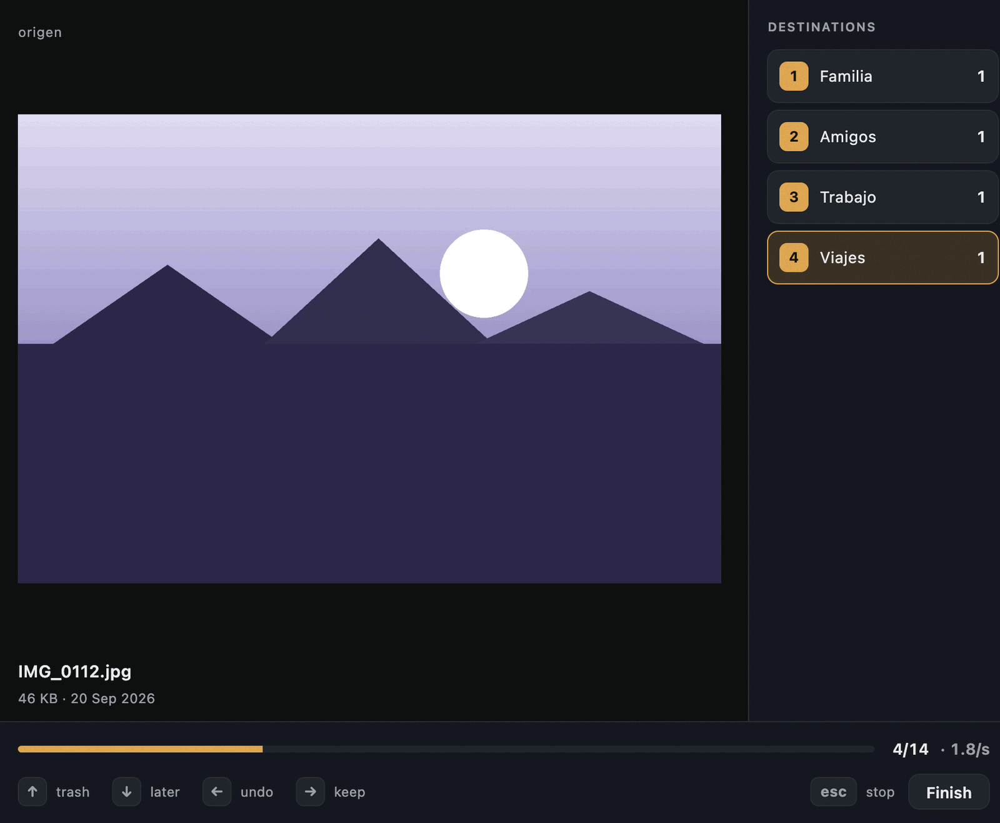
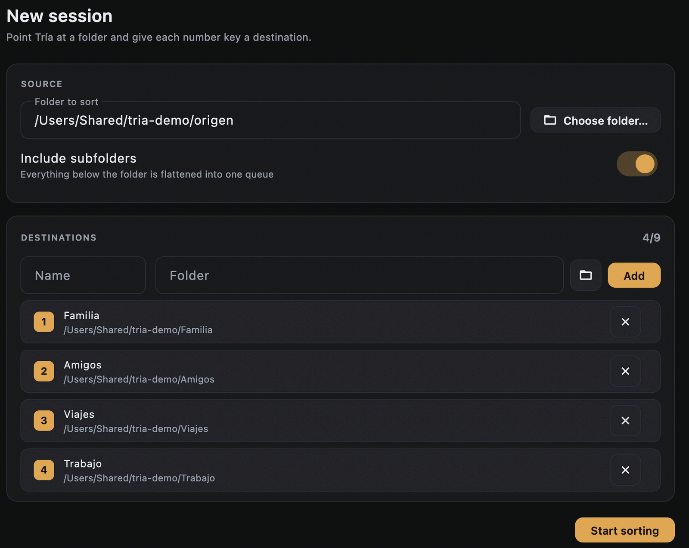
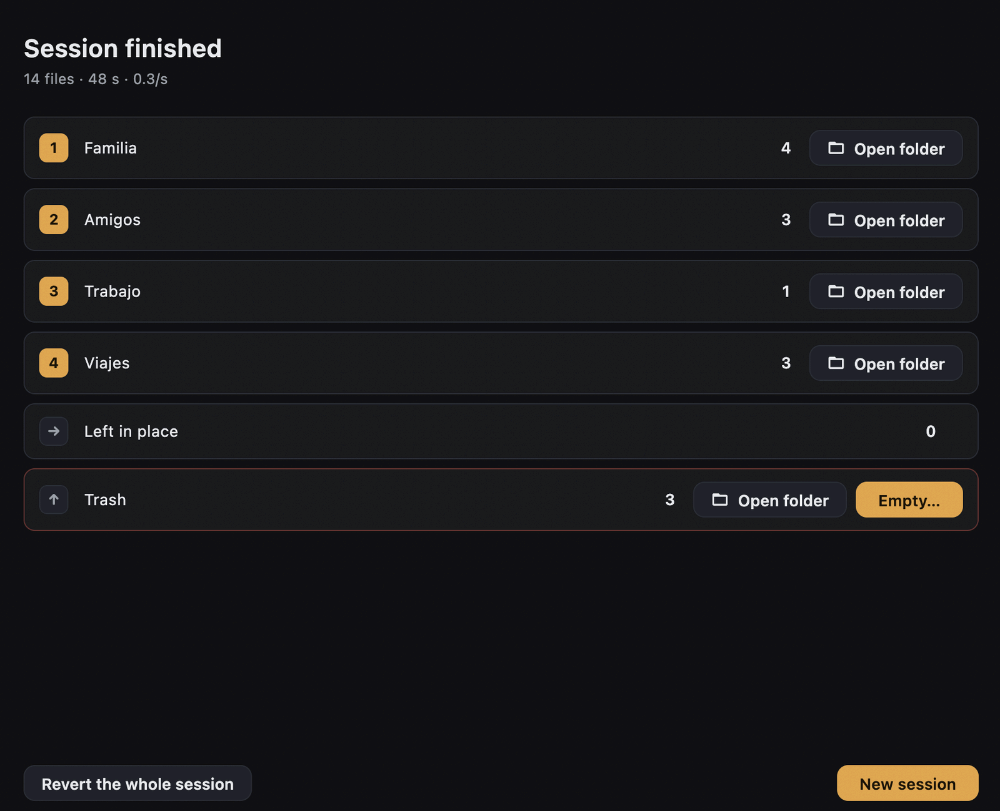
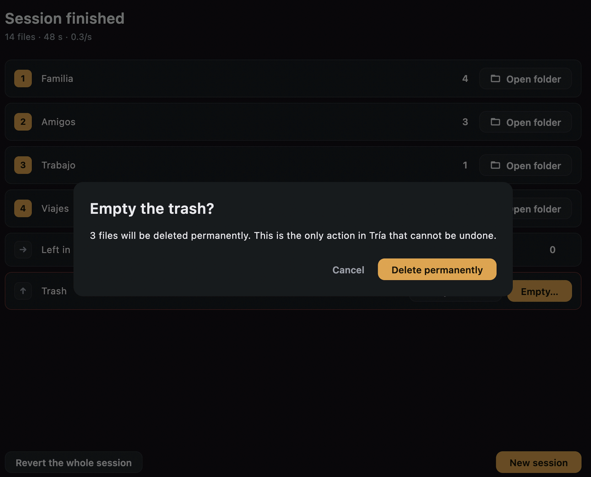

# Tría

> Clasifica miles de archivos en carpetas, una pulsación de tecla cada vez — y deshaz
> cualquier decisión.


[](https://github.com/devPatuel/tria/actions/workflows/ci.yml)

🇬🇧 [Read in English](README.en.md)



## De dónde viene

De un cambio de ordenador. Al pasar de una máquina a otra me encontré con miles de
archivos acumulados y sin orden, y la única forma de decidir qué hacer con cada uno era
abrirlos de uno en uno: doble clic, mirar, cerrar, arrastrar a una carpeta, volver atrás.
Con veinte archivos es tedioso; con varios miles, inviable.

El segundo uso apareció solo: tenía las fotos en Drive y quería bajarlas a un SSD ya
ordenadas y limpias — sin los memes, capturas y descargas absurdas que no merecen ocupar
sitio. Es el mismo problema que el anterior, solo que con más archivos y menos margen de
error, porque una foto borrada por accidente no vuelve.

De ahí salen las dos exigencias que definen la aplicación: **ver el archivo y decidir sin
soltar el teclado**, y **poder deshacer cualquier cosa**, incluso días después.

Tría **no** es un organizador por IA ni un culler profesional de fotografía. Cada decisión
es tuya; Tría solo se aparta del camino.

## Qué hace

Eliges una carpeta de origen y asocias hasta nueve carpetas de destino a las teclas `1`–`9`.
A partir de ahí Tría recorre la carpeta archivo por archivo, muestra una vista previa de
cada uno, y espera una única pulsación para enviarlo a su sitio y pasar al siguiente.

La configuración se guarda como perfil reutilizable, así que volver a la misma carpeta no
significa volver a configurar los destinos.



## Cómo se usa

| Tecla | Acción |
|---|---|
| `1`–`9` | Mover al destino configurado en esa tecla |
| `↑` | Papelera blanda |
| `↓` | Posponer — se vuelve a preguntar al final de la sesión |
| `←` | Deshacer la decisión anterior |
| `→` | Dejar donde está y seguir |
| `Esc` | Parar aquí y ver el resumen |

Los destinos van del `1` al `9` a propósito: son las teclas de la fila de números, y todo
el modelo de interacción depende de que no tengas que mirarte las manos.

Parar a medias no pierde nada: lo ya clasificado sigue clasificado, y al volver a abrir la
misma carpeta continúas donde lo dejaste, porque la carpeta misma es el marcador de
progreso.

Al terminar, la pantalla de resumen dice cuántos archivos fueron a cada destino y permite
abrir las carpetas resultantes en Finder o en el Explorador.



La papelera es blanda: nada se borra al pulsar `↑`, los archivos se apartan a una carpeta
y siguen ahí hasta que tú decides. Vaciarla es la única acción de Tría que no se puede
deshacer, y es la única que pide confirmación diciendo exactamente qué se pierde.



## Cómo funciona por dentro

La pieza central es un **diario append-only**. Cada pulsación escribe primero la
*intención* (`pending`), después ejecuta la operación en disco, y por último anota el
*resultado* (`done` o `failed`). Es el patrón *write-ahead log* de las bases de datos
aplicado al sistema de archivos: si el proceso muere a mitad, al reabrir la aplicación
encuentra las entradas `pending` y sabe exactamente qué tiene que verificar.

De esa decisión salen gratis las tres funciones en las que se basa la confianza:

- **Deshacer**, ilimitado dentro de la sesión.
- **Reanudar** después de cerrar o de un cierre inesperado.
- **Revertir una sesión entera**, incluso días después.

El resto de garantías:

- **Borrar es mover a una papelera blanda** (`_trash`, dentro de la carpeta de origen). Se
  evita a propósito la papelera del sistema: se comporta distinto en cada plataforma y
  esconde los archivos, que es lo contrario de lo que debe hacer una herramienta reversible.
  La única acción irreversible de toda la aplicación es vaciar esa papelera, y antes pregunta.
- **Nunca se sobrescribe.** Si ya existe un archivo con ese nombre en el destino, se añade un
  sufijo y el diario guarda el nombre real, para que deshacer siga funcionando.
- **Los movimientos entre discos se verifican.** Cambiar de volumen no es atómico: se copia,
  se comprueba, y solo entonces se borra el origen.
- **La interfaz nunca espera al disco.** Las operaciones van en una cola en segundo plano; a
  dos decisiones por segundo, la latencia de un disco externo rompería el ritmo, y el ritmo
  es el producto.
- **Sin red. Sin telemetría.** Nada sale de tu máquina.

El núcleo (`domain/`, `core/`) es Dart puro, sin un solo `import` de `flutter/`, lo que
permite probar toda la parte que toca tus archivos sin arrancar la interfaz.

Detalle completo en [docs/ARCHITECTURE.md](docs/ARCHITECTURE.md).

## Descargar

Descarga la última versión desde la [página de releases](https://github.com/devPatuel/tria/releases/latest):

| Sistema | Archivo |
|---|---|
| macOS (Apple Silicon e Intel) | `tria-macos.zip` |
| Windows (x64) | `tria-windows.zip` |

**Los binarios no están firmados**, así que el sistema avisará la primera vez:

- **macOS**: clic derecho sobre `tria.app` → *Abrir* → *Abrir*. Un doble clic normal no
  basta la primera vez. A partir de ahí se abre como cualquier otra app.
- **Windows**: SmartScreen mostrará un aviso → *Más información* → *Ejecutar de todos modos*.

Firmar y notarizar exige una cuenta de desarrollador de Apple, que cuesta dinero cada año.
Mientras el proyecto no tenga usuarios que lo justifiquen, la decisión es no pagarla y
documentar el rodeo aquí.

Si prefieres no fiarte de un binario sin firmar, compila desde el código: son tres comandos.

## Ejecutar desde el código

### Requisitos

| Requisito | Versión | Para qué |
|---|---|---|
| Flutter SDK | 3.x | Compilar y ejecutar la aplicación |
| Dart | 3.x | Viene con Flutter |
| Xcode | 15+ | Compilar en macOS |
| Visual Studio 2022 (con "Desarrollo para el escritorio con C++") | — | Compilar en Windows |

```bash
flutter doctor -v
```

Debe confirmar que tienes el SDK y el toolchain de la plataforma para la que vayas a
compilar.

### Ejecutar

```bash
git clone https://github.com/devPatuel/tria.git
cd tria
flutter pub get

flutter run -d macos      # en macOS
flutter run -d windows    # en Windows
```

En macOS, la aplicación está en sandbox y solo pide `files.user-selected.read-write`: el
acceso te lo concedes tú al elegir la carpeta en el diálogo del sistema. Por eso la pantalla
de configuración tiene un botón de carpeta y no basta con escribir la ruta a mano.

### Pasar los tests

```bash
flutter test
dart analyze --fatal-infos
```

Los tests del núcleo son Dart puro, sin interfaz de por medio. El CI pasa el analizador y
todos los tests en **macOS y en Windows** en cada push, porque el código que toca el disco
no se comporta igual en los dos sistemas.

Más detalle en [docs/SETUP.md](docs/SETUP.md).

## Estado

Funcionando: configuración con perfiles reutilizables, triaje completo por teclado, vistas
previas de imágenes, PDF y texto, papelera blanda, deshacer, reanudar sesión, revertir una
sesión entera, resumen con recuentos por destino.

Diseñado pero **no** implementado: abrir el archivo en el visor del sistema (`Intro`) y el
zoom 1:1 (`Espacio`).

Siguiente paso: **versión para Linux**. El núcleo ya es compatible (mismo modelo de errores
que macOS); falta generar el proyecto de la plataforma, abrir las carpetas con `xdg-open` y
compilarlo en el CI.

## Documentación

| Documento | Contenido |
|---|---|
| [ARCHITECTURE.md](docs/ARCHITECTURE.md) | Capas, flujo de datos, el diario |
| [DECISIONS.md](docs/DECISIONS.md) | Registro de decisiones de arquitectura (ADR) |
| [SECURITY.md](docs/SECURITY.md) | Qué toca Tría en tu disco, y qué nunca hace |
| [TESTING.md](docs/TESTING.md) | Estrategia de pruebas |
| [RELEASE.md](docs/RELEASE.md) | Runbook de compilación y publicación |

## Licencia

MIT © Jordi Patuel Pons
